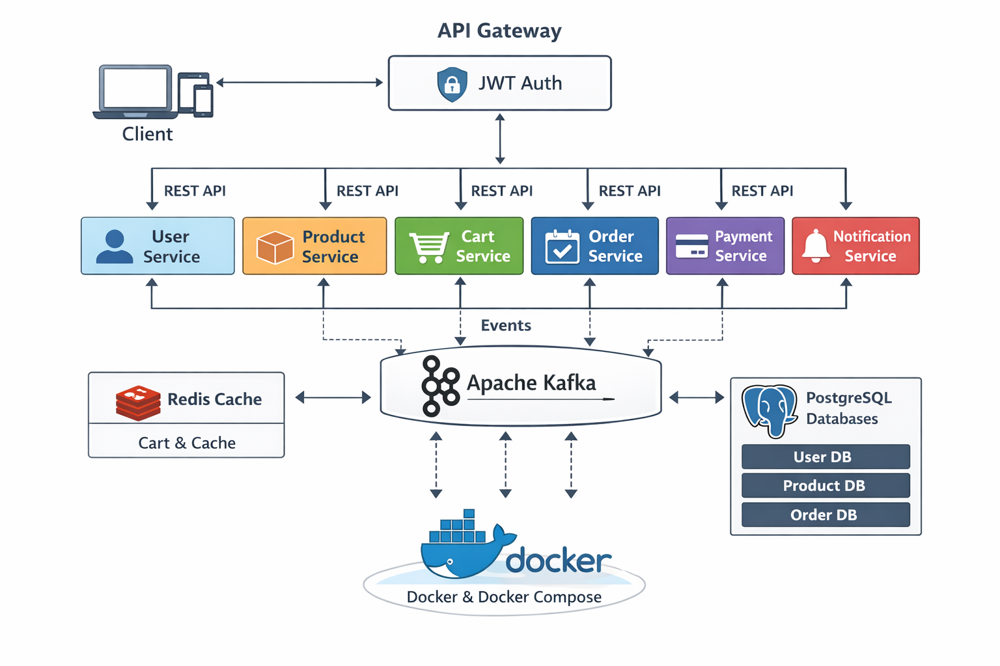

# Scalable E-Commerce Microservices Platform

A microservices-based e-commerce backend system built using Spring Boot, Kafka, Redis, PostgreSQL, and Docker. This project demonstrates scalable system design, event-driven architecture, and high-performance backend engineering practices.

---

## Features

- Microservices architecture with independently deployable services
- JWT-based authentication and authorization via API Gateway
- Event-driven communication using Apache Kafka
- Redis caching for high-performance operations (cart and caching)
- Fully containerized using Docker and Docker Compose
- Standardized API responses across all services
- Global exception handling and validation
- Loosely coupled and scalable system design

---

## Architecture Overview

The system follows a distributed microservices architecture:

- API Gateway acts as the single entry point
- Each service handles a specific domain
- Kafka enables asynchronous communication between services
- Redis is used for caching and fast data access
- PostgreSQL is used for persistent storage


---

## Tech Stack

### Backend
- Java
- Spring Boot
- Spring Cloud Gateway
- Spring Security (JWT)

### Data and Messaging
- PostgreSQL
- Redis
- Apache Kafka

### DevOps and Tools
- Docker
- Docker Compose
- Git

---

## Microservices

| Service | Description |
|--------|------------|
| User Service | Handles user registration and authentication |
| Product Service | Manages product catalog and inventory |
| Cart Service | Manages shopping cart using Redis |
| Order Service | Processes orders |
| Payment Service | Handles payment processing |
| Notification Service | Sends event-driven notifications |
| API Gateway | Routes requests and enforces security |

---

## Event-Driven Flow (Kafka)

- Order Created → Kafka → Payment Service
- Payment Success → Kafka → Notification Service

### Benefits
- Asynchronous processing
- Loose coupling
- High scalability

---

## API Response Format

All APIs follow a consistent response structure:

```json
{
  "timestamp": "2026-03-23T20:10:00",
  "status": 200,
  "message": "Success",
  "data": {},
  "error": null
}
```
---

## ▶️ How to Run

### 🔹 Prerequisites

Make sure the following are installed:

- Docker
- Git

---

### 🔹 Steps to Run

```bash
# Clone the repository
git clone https://github.com/NikhilaManogna/ecommerce-platform.git

# Navigate to project directory
cd ecommerce-platform

# Start all services
docker-compose up --build
```
---

### 🔹 Access Services

| Service | URL |
|--------|-----|
| API Gateway | http://localhost:8080 |
| User Service | http://localhost:8081 |
| Product Service | http://localhost:8082 |
| Order Service | http://localhost:8083 |

---

## 🚀 Performance Highlights

- Handles concurrent requests efficiently using microservices  
- Redis caching reduces database load  
- Kafka ensures reliable asynchronous processing  

---

## 🔐 Security

- JWT-based authentication  
- API Gateway for secure routing  
- Role-based access control (if implemented)  

---

## 🧠 Key Learnings

- Designing scalable microservices architecture  
- Implementing event-driven systems using Kafka  
- Optimizing performance with Redis caching  
- Containerizing applications using Docker  

---

## 📌 Future Enhancements

- Implement Saga pattern for distributed transactions  
- Add centralized logging (ELK stack)  
- Integrate monitoring (Prometheus + Grafana)  
- Add retry mechanisms for failed services  

---
